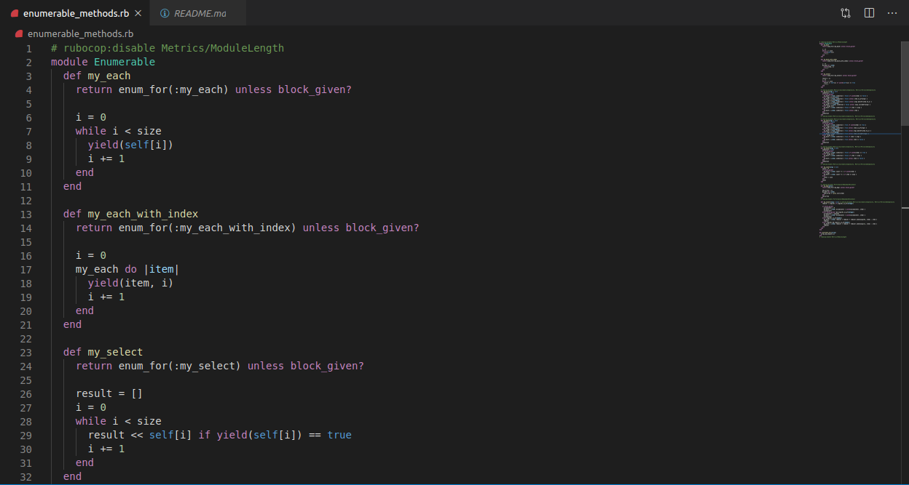

# Enumerable methods
This project uses enumerable module that gets mixed into the Array and Hash classes (among others) and provides lots of handy iterator methods.

## Built With

- Ruby, VSCODE

## Getting Started

To get a local copy up and running follow these simple example steps.

### Prerequisites
- Install ruby on linux
- Web browser
- Code editor
- Git and Github

### Usage
- Clone the project to your local machine 
- Open enumerable_method.rb
- Run ruby enumerable_method.rb in your terminal 

## Author
- Okikiola Apelehin

👤 **Author**

- Github: [@okikiola11](https://github.com/okikiola11)
- Twitter: [@Kikiolla3](https://twitter.com/Kikiolla3)
- Linkedin: [@okikiola-apelehin](https://www.linkedin.com/in/okikiola-apelehin-459008122/)

## 🤝 Contributing

Contributions, issues and feature requests are welcome!

Feel free to check the [issues page](https://github.com/okikiola11/enumerable_method/issues).

## Show your support

Give a ⭐️ if you like this project!

## Acknowledgments

- Google

## 📝 License

This project is [MIT](lic.url) licensed.